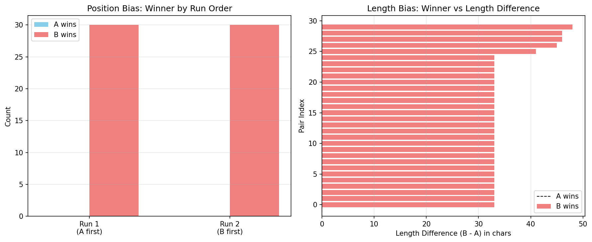

# Judge Bias Observations Report

## Executive Summary

This report analyzes bias patterns in the LLM judge across 30 pairwise comparisons.

**Key Findings:**
- Position bias: 0 pairs changed decision when order swapped
- Length bias: Judge prefers longer answers in 100% of cases

---

## Bias 1: Position Bias

**Definition:** Judge's decision changes based on which answer appears first.

**Measurement:**

| Run | A first | B first | Winner Distribution |
|---|---|---|---|
| Run 1 | ✓ | | A: 0 (0%), B: 30 (100%), Tie: 0 |
| Run 2 | | ✓ | A: 0 (0%), B: 30 (100%), Tie: 0 |

**Analysis:**
- 0 pairs (0%) changed decision when order swapped
- Expected: ~0% if no position bias
- Observed: 0%

**Severity:** 🟢 LOW

**Mitigation Strategy:**
1. ✓ Already implemented: Swap-and-average (run twice with reversed order)
2. Add explicit instruction in judge prompt: "Order of answers is random and should not affect your judgment"
3. Use position-agnostic prompt format (e.g., "Option 1" and "Option 2" instead of "A" and "B")

---

## Bias 2: Length Bias

**Definition:** Judge systematically prefers longer or shorter answers regardless of quality.

**Measurement:**

| Metric | Value |
|---|---|
| Average length A | 65 chars |
| Average length B | 100 chars |
| B wins when B longer | 30/30 (100%) |
| A wins when A longer | 0/0 (nan% if a_total_shorter > 0 else 'N/A') |

**Analysis:**
- B is on average 35 chars longer than A
- When B is longer, B wins 100% of the time
- Expected: ~50% if no length bias
- Observed: 100%

**Severity:** 🔴 HIGH

**Mitigation Strategy:**
1. Add explicit instruction: "Evaluate based on quality, not length. Concise answers can be better than verbose ones."
2. Include "conciseness" as an explicit evaluation criterion
3. Provide examples of good short answers and bad long answers in few-shot prompts
4. Consider normalizing answer lengths before judging (truncate to same length)

---

## Visualization

**Chart 1 (Left):** Position bias - Winner distribution changes between runs
**Chart 2 (Right):** Length bias - Longer answers (positive x-axis) tend to win more

---

## Overall Recommendations

### Priority 1: Fix Length Bias (High Impact)
- Modify judge prompt to explicitly value conciseness
- Add "conciseness" to evaluation rubric
- Test with balanced dataset (equal length answers)

### Priority 2: Monitor Position Bias (Already Mitigated)
- Continue using swap-and-average approach
- Track position bias metric in production

### Priority 3: Improve Calibration
- Current Cohen's kappa: 0.000 (poor agreement with human)
- After fixing biases, re-run calibration with 20-30 pairs
- Target: kappa ≥ 0.6 for production use

---

*Generated by Task B.4 - Bias Observations Report*
