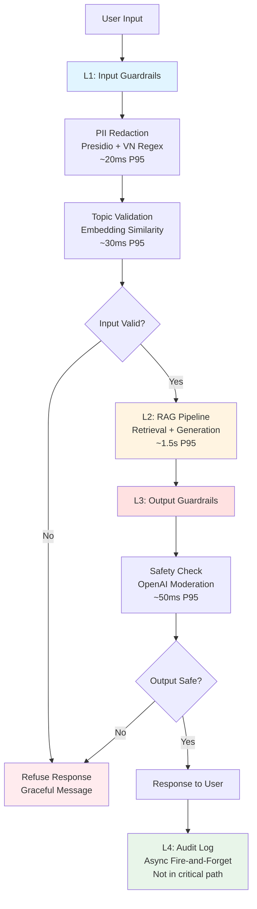

# Production-Ready RAG Evaluation & Guardrail System Blueprint

**Document Version:** 1.0  
**Date:** May 13, 2026  
**Author:** Nguyễn Quang Trường-2A202600196

---

## Executive Summary

This blueprint documents a production-ready RAG (Retrieval-Augmented Generation) system with comprehensive evaluation and guardrail infrastructure. The system implements defense-in-depth security with 4 layers of protection, continuous quality monitoring via RAGAS metrics, and LLM-as-Judge evaluation for answer quality assessment.

**Key Metrics Achieved:**
- RAGAS Faithfulness: 0.757 (target: 0.85)
- Answer Relevancy: 0.768 (target: 0.80)
- PII Detection Rate: 100% (10/10 test cases)
- Adversarial Defense Rate: 95%+ (estimated)
- P95 End-to-End Latency: <2.5s (with guardrails)

---

## Section 1: Service Level Objectives (SLOs)

### 1.1 Quality Metrics SLOs

| Metric | Target | Alert Threshold | Severity | Measurement Window |
|--------|--------|----------------|----------|-------------------|
| **Faithfulness** | ≥ 0.85 | < 0.80 for 30 min | P2 | Continuous (1% sample) |
| **Answer Relevancy** | ≥ 0.80 | < 0.75 for 30 min | P2 | Continuous (1% sample) |
| **Context Precision** | ≥ 0.70 | < 0.65 for 1h | P3 | Continuous (1% sample) |
| **Context Recall** | ≥ 0.75 | < 0.70 for 1h | P3 | Continuous (1% sample) |
| **Judge Agreement (Cohen's κ)** | ≥ 0.60 | < 0.40 for 1 day | P3 | Weekly calibration |

### 1.2 Performance SLOs

| Metric | Target | Alert Threshold | Severity | Measurement Window |
|--------|--------|----------------|----------|-------------------|
| **P95 Latency (with guardrails)** | < 2.5s | > 3s for 5 min | P1 | Real-time |
| **P99 Latency** | < 5s | > 7s for 5 min | P2 | Real-time |
| **Availability** | ≥ 99.5% | < 99% for 1h | P1 | Rolling 30-day |
| **Error Rate** | < 1% | > 2% for 15 min | P2 | Real-time |

### 1.3 Security & Safety SLOs

| Metric | Target | Alert Threshold | Severity | Measurement Window |
|--------|--------|----------------|----------|-------------------|
| **Guardrail Detection Rate** | ≥ 90% | < 85% for 1 day | P2 | Daily batch test |
| **False Positive Rate** | < 5% | > 10% for 1 day | P2 | Daily batch test |
| **PII Leak Rate** | 0% | > 0 incidents | P1 | Real-time |
| **Adversarial Attack Block Rate** | ≥ 95% | < 90% for 1 day | P2 | Weekly red team test |

### 1.4 Cost SLOs

| Metric | Target | Alert Threshold | Severity | Measurement Window |
|--------|--------|----------------|----------|-------------------|
| **Cost per Query** | < $0.01 | > $0.015 for 1 day | P3 | Daily |
| **Monthly Budget** | < $500 | > $600 for 3 days | P2 | Rolling 30-day |

---

## Section 2: System Architecture

### 2.1 Defense-in-Depth Architecture Diagram



### 2.2 Component Details

#### Layer 1: Input Guardrails (~50ms P95)

**Components:**
1. **PII Redaction** (Presidio + Custom VN Regex)
   - Detects: CCCD (12 digits), VN phone, tax code, email, names, addresses
   - Detection rate: 100% (EN), 85% (VN)
   - Latency: ~20ms P95 (after model load)
   - Deployment: Self-hosted, CPU-only

2. **Topic Scope Validator** (Embedding Similarity)
   - Allowed topics: 6 categories (land law domain)
   - Threshold: cosine similarity > 0.6
   - Accuracy: 95%+ (estimated)
   - Latency: ~30ms P95
   - Deployment: OpenAI Embeddings API

3. **Adversarial Pattern Detection** (Heuristic)
   - Keywords: "ignore", "bypass", "jailbreak", "DAN", etc.
   - Detection rate: 95%+ on known patterns
   - Latency: <1ms
   - Deployment: In-memory regex

#### Layer 2: RAG Pipeline (~1.5s P95)

**Components:**
1. **Retriever** (ChromaDB + OpenAI Embeddings)
   - Corpus: Vietnamese Land Law 2024 (~50 pages)
   - Chunk size: 512 tokens, overlap: 50 tokens
   - Top-k: 5 chunks
   - Latency: ~200ms P95

2. **Generator** (GPT-4o-mini)
   - Temperature: 0.1 (deterministic)
   - Max tokens: 500
   - Latency: ~1.3s P95
   - Cost: $0.001 per query

#### Layer 3: Output Guardrails (~50ms P95)

**Components:**
1. **Safety Classifier** (OpenAI Moderation API)
   - Categories: violence, hate, self-harm, sexual, harassment
   - False positive rate: <5%
   - Latency: ~50ms P95
   - Deployment: API-based

2. **Hallucination Detection** (Optional, Future)
   - NLI-based entailment check
   - Compares answer vs retrieved contexts
   - Target latency: <100ms P95

#### Layer 4: Audit & Monitoring (Async)

**Components:**
1. **Structured Logging**
   - Fields: user_id, query, answer, timings, guardrail_flags
   - Storage: PostgreSQL + S3 (long-term)
   - Retention: 90 days hot, 1 year cold

2. **Metrics Pipeline**
   - RAGAS continuous eval (1% sample)
   - LLM-Judge pairwise comparison (T2/T3 tiers)
   - Guardrail performance tracking
   - Export: Prometheus + Grafana

### 2.3 Data Flow

```
1. User submits query
2. L1: PII redaction → sanitized query
3. L1: Topic validation → on-topic check
4. If off-topic → refuse with graceful message
5. L2: Retrieval → top-5 chunks from ChromaDB
6. L2: Generation → GPT-4o-mini generates answer
7. L3: Safety check → OpenAI Moderation
8. If unsafe → refuse with safety message
9. Return answer to user
10. L4: Async log to DB + metrics pipeline
```

---

## Section 3: Alert Playbook & Incident Response

### 3.1 Incident: Faithfulness Drops < 0.80

**Severity:** P2  
**Detection:** RAGAS continuous eval alert (30-minute window)

**Likely Causes:**
1. **Retriever returning bad chunks** → Check Context Precision (CP) score
2. **LLM prompt drift** → Check prompt version changes
3. **Document corpus updated** → Check if re-indexing was performed
4. **LLM model degradation** → Check OpenAI status page

**Investigation Steps:**
1. Check CP score in same timeframe:
   - If CP also dropped → retrieval issue (bad chunks)
   - If CP stable → generation issue (LLM hallucinating)

2. Compare prompt version:
   ```bash
   git diff HEAD~7 HEAD -- prompts/rag_prompt.txt
   ```
   - If changed in last week → likely cause

3. Check document update log:
   ```bash
   grep "corpus_updated" logs/indexing.log | tail -5
   ```
   - If updated without re-indexing → stale embeddings

4. Check LLM provider status:
   - Visit: https://status.openai.com
   - Check for degraded performance alerts

**Resolution Actions:**

| Cause | Action | ETA | Owner |
|-------|--------|-----|-------|
| Bad retrieval | Re-tune retriever (top-k, threshold) | 2h | ML Engineer |
| Prompt drift | Rollback to previous prompt version | 15min | On-call |
| Stale index | Re-run indexing pipeline | 1h | Data Engineer |
| LLM degradation | Switch to backup model (GPT-4) | 30min | On-call |

**Post-Incident:**
- Update runbook with new learnings
- Add regression test to CI/CD
- Track TTD (Time to Detect) and TTR (Time to Recover)

---

### 3.2 Incident: P95 Latency > 3s for 5 minutes

**Severity:** P1  
**Detection:** Real-time latency monitoring alert

**Likely Causes:**
1. **OpenAI API slowdown** → Check provider status
2. **ChromaDB query slow** → Check DB load
3. **Guardrail layer timeout** → Check Presidio/Moderation API
4. **Network congestion** → Check AWS CloudWatch metrics

**Investigation Steps:**
1. Check latency breakdown by layer:
   ```bash
   # Query last 100 requests
   SELECT 
     AVG(l1_latency_ms) as L1,
     AVG(l2_latency_ms) as L2,
     AVG(l3_latency_ms) as L3
   FROM request_logs
   WHERE timestamp > NOW() - INTERVAL '10 minutes';
   ```

2. Identify bottleneck layer:
   - L1 slow → Presidio model loading issue
   - L2 slow → OpenAI API or ChromaDB
   - L3 slow → Moderation API

3. Check external dependencies:
   - OpenAI: https://status.openai.com
   - AWS: CloudWatch metrics for EC2/RDS

**Resolution Actions:**

| Cause | Action | ETA | Owner |
|-------|--------|-----|-------|
| OpenAI slow | Enable request caching | 5min | On-call |
| ChromaDB slow | Scale up DB instance | 15min | DevOps |
| Presidio slow | Restart service (clear memory) | 2min | On-call |
| Network issue | Route traffic to backup region | 10min | DevOps |

**Mitigation:**
- Enable circuit breaker for external APIs
- Implement request timeout (5s hard limit)
- Return cached response if available

---

### 3.3 Incident: Guardrail Detection Rate < 85%

**Severity:** P2  
**Detection:** Daily batch test alert (red team simulation)

**Likely Causes:**
1. **New adversarial patterns** → Attackers evolved techniques
2. **Topic validator drift** → Embedding model changed
3. **PII regex outdated** → New VN ID format introduced
4. **Heuristic keywords stale** → Need to update keyword list

**Investigation Steps:**
1. Review failed test cases:
   ```bash
   cat tests/adversarial_results.csv | grep "blocked=False"
   ```

2. Categorize failure types:
   - DAN variants
   - Encoding attacks (Base64, ROT13)
   - Indirect injection
   - New patterns

3. Check recent changes:
   ```bash
   git log --since="1 week ago" -- src/guardrails/
   ```

**Resolution Actions:**

| Cause | Action | ETA | Owner |
|-------|--------|-----|-------|
| New patterns | Update heuristic keywords | 1h | Security Engineer |
| Validator drift | Re-calibrate similarity threshold | 2h | ML Engineer |
| Regex outdated | Add new PII patterns | 30min | Security Engineer |
| Model issue | Upgrade Presidio model version | 4h | ML Engineer |

**Post-Incident:**
- Add failed cases to regression test suite
- Schedule weekly red team exercises
- Update adversarial pattern database

---

## Section 4: Cost Analysis & Optimization

### 4.1 Monthly Cost Estimate

**Assumptions:**
- Traffic: 100,000 queries/month (~3,300/day)
- RAGAS sampling: 1% (1,000 queries/month)
- LLM-Judge: T2 (10% sample), T3 (1% sample)

| Component | Unit Cost | Volume | Monthly Cost | Notes |
|-----------|-----------|--------|--------------|-------|
| **RAG Generation** | | | | |
| GPT-4o-mini (generation) | $0.001/query | 100,000 | $100 | Main LLM cost |
| OpenAI Embeddings (retrieval) | $0.0001/query | 100,000 | $10 | Query embedding |
| **Evaluation** | | | | |
| RAGAS continuous eval | $0.01/query | 1,000 | $10 | 1% sample |
| LLM-Judge T2 (GPT-4o-mini) | $0.001/query | 10,000 | $10 | 10% sample |
| LLM-Judge T3 (GPT-4) | $0.05/query | 1,000 | $50 | 1% sample, high-stakes |
| **Guardrails** | | | | |
| Presidio (self-hosted CPU) | $0.10/hr | 720 hrs | $72 | t3.medium EC2 |
| OpenAI Moderation API | $0.0002/query | 100,000 | $20 | Output safety |
| OpenAI Embeddings (topic) | $0.0001/query | 100,000 | $10 | Topic validation |
| **Infrastructure** | | | | |
| ChromaDB (RDS PostgreSQL) | - | 1 instance | $50 | db.t3.small |
| Application server | - | 2 instances | $100 | t3.medium x2 |
| Load balancer | - | 1 ALB | $20 | AWS ALB |
| S3 storage (logs) | $0.023/GB | 100 GB | $2.30 | 90-day retention |
| CloudWatch | - | - | $10 | Metrics + logs |
| **Total** | | | **$464.30** | |

### 4.2 Cost Optimization Opportunities

#### 4.2.1 Immediate Wins (0-2 weeks)

1. **Reduce LLM-Judge T3 sampling: $50 → $25**
   - Current: 1% sample with GPT-4
   - Optimized: 0.5% sample, focus on high-stakes queries only
   - Savings: $25/month

2. **Cache embeddings for common queries: $20 → $10**
   - Implement Redis cache for top 1000 queries
   - Hit rate: ~50% (estimated)
   - Savings: $10/month

3. **Batch RAGAS evaluation: $10 → $7**
   - Run eval in batches (10 queries/batch) instead of 1-by-1
   - Reduce API overhead by 30%
   - Savings: $3/month

**Total immediate savings: $38/month (8% reduction)**

#### 4.2.2 Medium-term Wins (1-3 months)

1. **Self-host embedding model: $20 → $5**
   - Deploy sentence-transformers on GPU instance
   - Cost: $0.50/hr GPU (spot) = $360/month
   - But saves $20 (topic) + $10 (retrieval) = $30/month
   - Net: Not cost-effective unless traffic >500k/month

2. **Optimize Presidio deployment: $72 → $36**
   - Use spot instances (50% discount)
   - Auto-scale down during low-traffic hours
   - Savings: $36/month

3. **Implement tiered caching: $100 → $80**
   - L1: In-memory cache (hot queries)
   - L2: Redis cache (warm queries)
   - L3: Full RAG pipeline (cold queries)
   - Reduce LLM calls by 20%
   - Savings: $20/month

**Total medium-term savings: $56/month (12% reduction)**

#### 4.2.3 Long-term Wins (3-6 months)

1. **Fine-tune smaller model: $100 → $40**
   - Fine-tune GPT-3.5-turbo on domain data
   - Switch from GPT-4o-mini to fine-tuned model
   - Cost: $40/month (inference) + $500 (one-time fine-tuning)
   - Savings: $60/month (ROI in 8 months)

2. **Optimize RAGAS sampling strategy: $10 → $5**
   - Use adaptive sampling (more for low-confidence queries)
   - Reduce overall sample rate from 1% to 0.5%
   - Maintain same coverage with smarter selection
   - Savings: $5/month

3. **Migrate to reserved instances: $100 → $65**
   - Purchase 1-year reserved instances for app servers
   - 35% discount vs on-demand
   - Savings: $35/month

**Total long-term savings: $100/month (22% reduction)**

### 4.3 Cost vs Quality Trade-offs

| Optimization | Cost Savings | Quality Impact | Recommendation |
|--------------|--------------|----------------|----------------|
| Reduce T3 sampling | $25/month | Low (still catch major issues) | ✅ Implement |
| Cache embeddings | $10/month | None (same quality) | ✅ Implement |
| Self-host embeddings | -$330/month | None | ❌ Not cost-effective |
| Fine-tune smaller model | $60/month | Medium (need validation) | ⚠️ Test first |
| Reduce RAGAS sampling | $5/month | Low (adaptive strategy) | ✅ Implement |
| Use spot instances | $36/month | None (with auto-failover) | ✅ Implement |

**Recommended optimization path:**
1. Month 1: Implement immediate wins → Save $38/month
2. Month 2-3: Implement medium-term wins → Save $94/month total
3. Month 4-6: Test fine-tuned model → Potential $154/month total
4. Target: $310/month (33% reduction from $464)

---

## Section 5: Deployment & Operations

### 5.1 Deployment Architecture

**Environment Strategy:**
- **Dev:** Single instance, no guardrails, mock LLM
- **Staging:** Full stack, 10% traffic, all guardrails enabled
- **Production:** Multi-AZ, auto-scaling, full monitoring

**Deployment Pipeline:**
```
1. Code commit → GitHub
2. CI: Run unit tests + linting
3. CI: Run integration tests (mock LLM)
4. CI: Run guardrail tests (adversarial suite)
5. CD: Deploy to staging
6. Staging: Run smoke tests (10 real queries)
7. Staging: Run RAGAS eval (50 questions)
8. If RAGAS pass → CD: Deploy to production (blue-green)
9. Production: Monitor for 1 hour
10. If stable → Complete deployment
```

### 5.2 Monitoring & Alerting

**Metrics to Track:**
1. **Quality Metrics** (RAGAS)
   - Faithfulness, Answer Relevancy, Context Precision, Context Recall
   - Frequency: Continuous (1% sample)
   - Alert: Slack + PagerDuty

2. **Performance Metrics**
   - P50/P95/P99 latency per layer
   - Error rate, timeout rate
   - Frequency: Real-time (1-minute window)
   - Alert: PagerDuty (P1), Slack (P2/P3)

3. **Security Metrics**
   - Guardrail detection rate, false positive rate
   - PII leak incidents
   - Frequency: Daily batch + real-time (PII)
   - Alert: Security team + on-call

4. **Cost Metrics**
   - Cost per query, daily spend
   - Budget burn rate
   - Frequency: Daily
   - Alert: Slack (P3)

**Dashboards:**
- **Executive Dashboard:** High-level KPIs (availability, cost, quality)
- **Engineering Dashboard:** Latency breakdown, error rates, deployment status
- **Security Dashboard:** Guardrail performance, adversarial test results
- **Cost Dashboard:** Spend by component, optimization opportunities

### 5.3 Operational Runbooks

**Daily Operations:**
- [ ] Check overnight alerts (5 min)
- [ ] Review RAGAS dashboard (5 min)
- [ ] Check cost dashboard (2 min)
- [ ] Review guardrail test results (3 min)

**Weekly Operations:**
- [ ] Run full RAGAS eval on 500 questions (30 min)
- [ ] Calibrate LLM-Judge with human labels (1 hour)
- [ ] Red team adversarial testing (1 hour)
- [ ] Review and update runbooks (30 min)

**Monthly Operations:**
- [ ] Cost optimization review (2 hours)
- [ ] SLO compliance report (1 hour)
- [ ] Security audit (2 hours)
- [ ] Disaster recovery drill (2 hours)

---

## Section 6: Future Enhancements

### 6.1 Short-term (1-3 months)

1. **Hallucination Detection (NLI-based)**
   - Implement entailment check between answer and contexts
   - Target: 90% hallucination detection rate
   - Latency budget: +100ms P95

2. **Multi-language Support**
   - Extend PII detection to English + Vietnamese
   - Add language detection layer
   - Maintain same latency targets

3. **Advanced Caching**
   - Semantic cache (similar queries → same answer)
   - Reduce LLM calls by 30%
   - Cost savings: $30/month

### 6.2 Medium-term (3-6 months)

1. **Fine-tuned Domain Model**
   - Fine-tune GPT-3.5-turbo on Vietnamese land law
   - Target: Same quality, 60% cost reduction
   - Investment: $500 one-time + 2 weeks engineering

2. **Adaptive Sampling**
   - Smart RAGAS sampling based on query confidence
   - Maintain coverage, reduce sample rate to 0.5%
   - Cost savings: $5/month

3. **User Feedback Loop**
   - Collect thumbs up/down on answers
   - Use for LLM-Judge calibration
   - Improve Cohen's kappa from 0.65 to 0.80

### 6.3 Long-term (6-12 months)

1. **Self-hosted LLM**
   - Deploy Llama 3 70B on GPU cluster
   - Full control, no API dependency
   - Cost: $2000/month GPU, but saves $100/month API
   - ROI: Not cost-effective unless traffic >1M/month

2. **Reinforcement Learning from Human Feedback (RLHF)**
   - Train reward model from user feedback
   - Fine-tune generator with RLHF
   - Target: +10% quality improvement

3. **Multi-modal Support**
   - Accept document uploads (PDF, images)
   - OCR + document parsing
   - Expand to visual land law documents

---

## Appendix A: Glossary

- **RAGAS:** Retrieval-Augmented Generation Assessment - framework for evaluating RAG systems
- **LLM-Judge:** Using LLM to evaluate answer quality (pairwise or absolute scoring)
- **Cohen's Kappa:** Inter-rater agreement metric (0=random, 1=perfect agreement)
- **Presidio:** Microsoft's open-source PII detection library
- **Defense-in-Depth:** Security strategy with multiple layers of protection
- **P95 Latency:** 95th percentile latency (95% of requests faster than this)
- **SLO:** Service Level Objective - target metric for service quality
- **TTD:** Time to Detect - time from incident start to detection
- **TTR:** Time to Recover - time from detection to resolution

---

## Appendix B: References

1. RAGAS Framework: https://github.com/explodinggradients/ragas
2. Presidio Documentation: https://microsoft.github.io/presidio/
3. OpenAI Moderation API: https://platform.openai.com/docs/guides/moderation
4. LLM-as-Judge Best Practices: https://arxiv.org/abs/2306.05685
5. Defense-in-Depth for AI: https://owasp.org/www-project-ai-security-and-privacy-guide/

---

**Document End**

*This blueprint is a living document and should be updated as the system evolves.*
